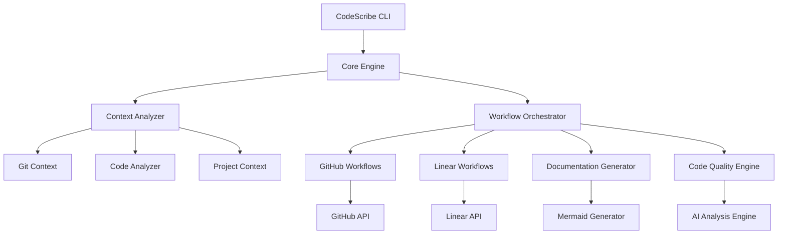

# Enhanced CodeScribe Workflows Design Document

## Overview

The enhanced CodeScribe system will transform the current single-purpose PR creation tool into a comprehensive workflow orchestration platform for professional software engineers. The system will maintain its current core functionality while adding modular workflow engines for GitHub automation, visual documentation generation, enhanced Linear integration, and code quality management.

## Architecture

### High-Level Architecture



### Core Components

1. **Core Engine**: Central orchestrator that manages workflow execution and coordinates between components
2. **Context Analyzer**: Enhanced version of current context gathering with deeper code analysis
3. **Workflow Orchestrator**: Plugin-based system for managing different workflow types
4. **AI Analysis Engine**: Enhanced AI integration with multiple models and specialized prompts (using Gemini 2.5 pro with the already set up API setup)
5. **Configuration Manager**: Handles user preferences, project settings, and workflow configurations

## Components and Interfaces

### Core Engine Interface

```javascript
class CodeScribeCore {
    constructor(config) {
        this.config = config;
        this.contextAnalyzer = new ContextAnalyzer();
        this.workflowOrchestrator = new WorkflowOrchestrator();
        this.aiEngine = new AIAnalysisEngine();
    }
    
    async execute(command, options) {
        const context = await this.contextAnalyzer.gather();
        const workflows = this.workflowOrchestrator.selectWorkflows(command, context);
        return await this.workflowOrchestrator.execute(workflows, context, options);
    }
}
```

### Context Analyzer Interface

```javascript
class ContextAnalyzer {
    async gather() {
        return {
            git: await this.gatherGitContext(),
            code: await this.analyzeCodeChanges(),
            project: await this.analyzeProjectStructure(),
            dependencies: await this.analyzeDependencies(),
            tests: await this.analyzeTestCoverage(),
            performance: await this.analyzePerformanceMetrics()
        };
    }
    
    async analyzeCodeChanges() {
        // Enhanced code analysis with AST parsing, complexity metrics, security scanning
    }
}
```

### Workflow Orchestrator Interface

```javascript
class WorkflowOrchestrator {
    constructor() {
        this.workflows = new Map();
        this.registerDefaultWorkflows();
    }
    
    registerWorkflow(name, workflow) {
        this.workflows.set(name, workflow);
    }
    
    selectWorkflows(command, context) {
        // Intelligent workflow selection based on context and command
    }
    
    async execute(workflows, context, options) {
        // Parallel and sequential workflow execution with dependency management
    }
}
```

### GitHub Workflows Engine

```javascript
class GitHubWorkflows {
    async createPR(context, options) {
        // Enhanced PR creation with templates, reviewers, labels
    }
    
    async manageIssues(context) {
        // Automatic issue creation from code analysis
    }
    
    async manageBranches(context) {
        // Branch cleanup, protection rules, merge strategies
    }
    
    async generateReleaseNotes(context) {
        // Automated release note generation from commits and PRs
    }
}
```

### Linear Workflows Engine

```javascript
class LinearWorkflows {
    async updateTicketStatus(ticketId, status, context) {
        // Enhanced ticket management with time tracking
    }
    
    async createSubTickets(parentTicket, tasks) {
        // Automatic sub-ticket creation from code analysis
    }
    
    async generateProjectReports(projectId) {
        // Automated project status reports
    }
    
    async manageBlockers(ticketId, blockers) {
        // Blocker detection and management
    }
}
```

### Documentation Generator

```javascript
class DocumentationGenerator {
    async generateMermaidDiagrams(codeContext) {
        // Generate flowcharts, sequence diagrams, architecture diagrams
    }
    
    async generateAPIDocumentation(apiChanges) {
        // Generate OpenAPI specs and API documentation
    }
    
    async generateADRs(architecturalChanges) {
        // Generate Architecture Decision Records
    }
    
    async generateOnboardingDocs(projectContext) {
        // Generate team onboarding documentation
    }
}
```

## Data Models

### Context Model

```javascript
const ContextSchema = {
    git: {
        branch: String,
        commits: Array,
        diff: String,
        remoteUrl: String,
        status: Object
    },
    code: {
        changes: Array,
        complexity: Object,
        security: Object,
        dependencies: Array,
        testCoverage: Object
    },
    project: {
        structure: Object,
        configuration: Object,
        metadata: Object
    },
    linear: {
        ticketId: String,
        ticketData: Object,
        projectData: Object
    }
};
```

### Workflow Configuration Model

```javascript
const WorkflowConfigSchema = {
    name: String,
    triggers: Array,
    conditions: Array,
    actions: Array,
    dependencies: Array,
    parallel: Boolean,
    retryPolicy: Object,
    notifications: Array
};
```

### AI Analysis Model

```javascript
const AIAnalysisSchema = {
    codeQuality: {
        complexity: Number,
        maintainability: Number,
        testability: Number,
        suggestions: Array
    },
    security: {
        vulnerabilities: Array,
        recommendations: Array
    },
    performance: {
        bottlenecks: Array,
        optimizations: Array
    },
    documentation: {
        missing: Array,
        outdated: Array,
        suggestions: Array
    }
};
```

## Error Handling

### Error Categories

1. **API Errors**: GitHub, Linear, AI service failures with retry logic
2. **Git Errors**: Repository state issues, merge conflicts, permission errors
3. **Configuration Errors**: Missing credentials, invalid settings
4. **Analysis Errors**: Code parsing failures, dependency resolution issues
5. **Workflow Errors**: Execution failures, dependency conflicts

### Error Recovery Strategies

```javascript
class ErrorHandler {
    async handleAPIError(error, context) {
        if (error.isRetryable()) {
            return await this.retryWithBackoff(error.operation, context);
        }
        return await this.fallbackStrategy(error, context);
    }
    
    async handleGitError(error, context) {
        // Git-specific error recovery (stash, reset, conflict resolution)
    }
    
    async handleWorkflowError(error, workflow, context) {
        // Workflow rollback and partial completion handling
    }
}
```

## Testing Strategy

### Unit Testing

- **Component Testing**: Each workflow engine, context analyzer, and AI integration
- **Mock Services**: GitHub API, Linear API, AI services for isolated testing
- **Configuration Testing**: Various project configurations and edge cases

### Integration Testing

- **End-to-End Workflows**: Complete workflow execution from CLI to service updates
- **API Integration**: Real API calls with test repositories and projects
- **Cross-Platform Testing**: Windows, macOS, Linux compatibility

### Performance Testing

- **Large Repository Handling**: Performance with large codebases and diffs
- **Concurrent Workflow Execution**: Multiple workflows running simultaneously
- **AI Service Load Testing**: Handling AI service rate limits and failures

### Test Structure

```javascript
describe('Enhanced CodeScribe Workflows', () => {
    describe('Core Engine', () => {
        it('should orchestrate multiple workflows correctly');
        it('should handle workflow dependencies');
        it('should recover from partial failures');
    });
    
    describe('GitHub Workflows', () => {
        it('should create PRs with enhanced metadata');
        it('should manage issues automatically');
        it('should handle branch operations');
    });
    
    describe('Linear Integration', () => {
        it('should update tickets with detailed context');
        it('should create sub-tickets from analysis');
        it('should track time and progress');
    });
    
    describe('Documentation Generation', () => {
        it('should generate accurate Mermaid diagrams');
        it('should create comprehensive API docs');
        it('should produce helpful ADRs');
    });
});
```

## Configuration and Extensibility

### Plugin Architecture

The system will support custom workflows through a plugin system:

```javascript
class CustomWorkflow extends BaseWorkflow {
    constructor(config) {
        super(config);
        this.name = 'custom-workflow';
        this.triggers = ['custom-trigger'];
    }
    
    async execute(context, options) {
        // Custom workflow implementation
    }
}

// Registration
codescribe.registerWorkflow(new CustomWorkflow(config));
```

### Configuration Management

```javascript
const defaultConfig = {
    workflows: {
        github: { enabled: true, templates: 'default' },
        linear: { enabled: true, autoTransition: true },
        documentation: { enabled: true, formats: ['mermaid', 'markdown'] },
        quality: { enabled: true, thresholds: { complexity: 10 } }
    },
    ai: {
        provider: 'gemini',
        model: 'gemini-1.5-flash',
        fallback: 'gpt-3.5-turbo'
    },
    notifications: {
        slack: { enabled: false },
        email: { enabled: false },
        teams: { enabled: false }
    }
};
```