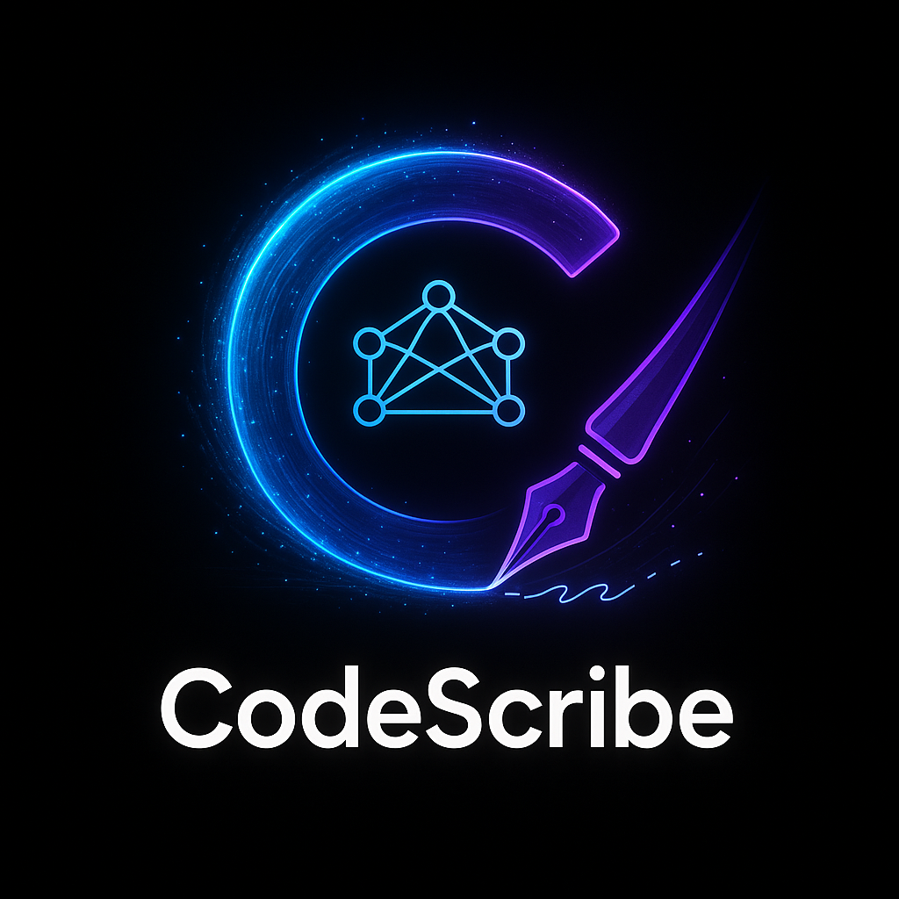

<div align="center">

  <!-- Replace with your stunning logo generated by the AI -->
  

  <h1>CodeScribe</h1>
  <p><strong>From Linear ticket to pull request, automated.</strong></p>
  <p>
    An AI-powered agent ecosystem that automates the entire development pipeline, from generating initial code drafts to creating fully-packaged pull requests.
  </p>
  
  <p>
    <a href="#the-problem-the-cold-start--the-final-mile">The Problem</a> •
    <a href="#the-solution-your-ai-apprentice">The Solution</a> •
    <a href="#a-day-in-the-life-with-codescribe">How It Works</a> •
    <a href="#quick-start">Quick Start</a> •
    <a href="#tech-stack">Tech Stack</a>
  </p>

  <p>
    <!-- Add Badges for your project -->
    
    
    
    
  </p>
</div>

---

## The Problem: The "Cold Start" & The "Final Mile"

Every developer knows the loop. A new ticket lands. The first thirty minutes are a momentum-killing grind of context-switching, file-hunting, and boilerplate. Then, after hours of brilliant coding, you face the "final mile": another thirty minutes of writing commit messages, crafting PR descriptions, running quality checks, and updating tickets.

This friction at the beginning and end of every task is a massive drain on creativity and velocity.

## The Solution: Your AI Apprentice

**CodeScribe** is a comprehensive agent ecosystem built to eliminate this friction entirely. We're not just another AI assistant; we are a proactive automation platform that handles the tedious work so developers can focus on what they do best: building.

*   **💡 The Idea Engine:** For Product Managers, CodeScribe takes a high-level feature request and uses a Vellum workflow to generate a preliminary code diff, providing a tangible starting point for engineering.
*   **🚀 The Developer's Co-Pilot:** For Developers, CodeScribe lives in the Warp terminal, providing a suite of commands to kickstart development and automate the entire PR submission process.
*   **🤖 The Team's Reviewer:** For the whole team, CodeScribe acts as a tireless agent inside Linear, responding to `@mentions` to perform automated code reviews.

---

## A Day in the Life with CodeScribe

This is not just a tool; it's a completely new way to work.

### 1. The Kickstart: From Ticket to Code in Seconds
A developer is assigned a ticket `COD-42`. Instead of starting from scratch, they run one command.

`codescribe apply COD-42`

Instantly, the AI-generated starter code from our Vellum workflow is applied to their local files. The "cold start" problem is solved.

### 2. The Finish Line: From Code to PR in One Command
After the developer has applied their expertise and finished coding, they run the ultimate command.

`codescribe pr`

This single command triggers a powerful automation cascade:
*   **AI-Generated Commits:** Analyzes changes and writes perfect, conventional commit messages.
*   **Automated PRs:** Creates or updates a GitHub pull request with a rich, AI-generated description.
*   **Visual Documentation:** For complex logic, it **auto-generates Mermaid diagrams** and embeds them in the PR.
*   **Built-in Scans:** Performs quick code quality and security checks.
*   **Seamless Sync:** Posts a final "Agent Action" back to the Linear ticket with the PR link.

The developer never leaves their terminal. The "final mile" is covered in seconds.

---

## Quick Start

Get up and running with CodeScribe in minutes.

### 1. Installation
Clone the repository and install dependencies.
```bash
git clone https://github.com/your-username/your-repo.git
cd your-repo
npm install
