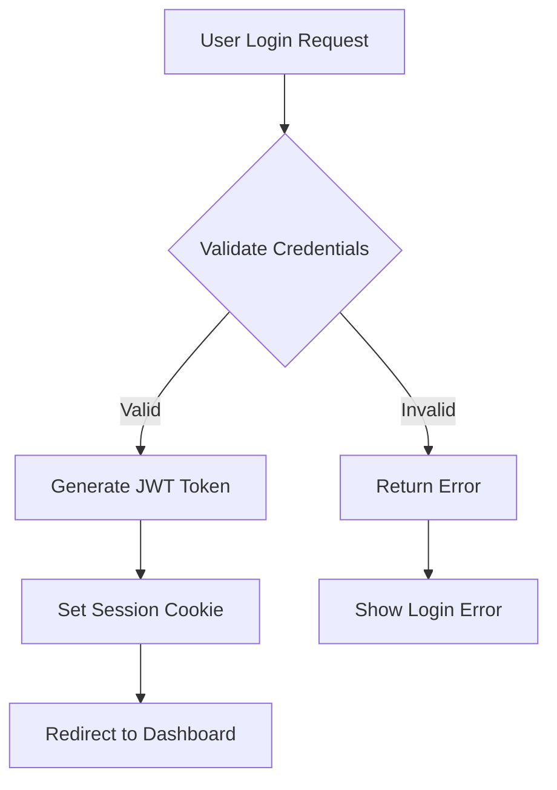

# CodeScribe Workflow Reference

This document provides a comprehensive reference for all CodeScribe workflows, their use cases, and detailed examples.

## Overview of Workflows

CodeScribe provides several specialized workflows designed for different development scenarios:

| Workflow | Command | Use Case | Key Features |
|----------|---------|----------|--------------|
| **Default/PR** | `codescribe.js` | Complete development cycle | Full GitHub + Linear + Docs integration |
| **Commit** | `codescribe.js commit` | Intelligent commit creation | AI-generated messages, staging, pushing |
| **Interactive** | `codescribe.js interactive` | Guided workflow selection | Context-aware suggestions |
| **Documentation** | `codescribe.js docs` | Generate documentation | Mermaid diagrams, API docs, ADRs |
| **Quality** | `codescribe.js quality` | Code analysis | Security, complexity, performance |
| **Linear** | `codescribe.js linear` | Ticket management | Status updates, sub-tickets, tracking |
| **Feature** | `codescribe.js feature` | Feature development | Optimized for feature branches |
| **Fix** | `codescribe.js fix` | Bug fixes | Issue management, regression testing |
| **Review** | `codescribe.js review` | Code review assistance | Analysis and suggestions |
| **Release** | `codescribe.js release` | Release preparation | Changelog, tags, deployment prep |

## Detailed Workflow Documentation

### Default/PR Workflow

**Command:** `node codescribe.js` or `node codescribe.js pr`

**Purpose:** The most comprehensive workflow that handles the complete development lifecycle from code analysis to PR creation and Linear ticket management.

**What it does:**
1. **Context Analysis**: Gathers git context, analyzes code changes, project structure
2. **AI Analysis**: Performs intelligent code analysis using Gemini AI
3. **GitHub Integration**: Creates or updates pull requests with detailed descriptions
4. **Linear Integration**: Updates ticket status, adds progress comments, creates sub-tickets
5. **Documentation**: Generates Mermaid diagrams and visual documentation
6. **Quality Analysis**: Performs security scanning and complexity analysis

**Example Usage:**
```bash
# Basic usage - full workflow
node codescribe.js

# With options
node codescribe.js --verbose --dry-run

# Legacy GitHub-only mode
node codescribe.js github-only
```

**Best for:**
- Feature development completion
- Regular development workflow
- When you want comprehensive tracking and documentation

### Commit Workflow

**Command:** `node codescribe.js commit`

**Purpose:** Create intelligent commits with AI-generated messages that explain both what changed and why.

**What it does:**
1. **Change Analysis**: Analyzes git diff and code changes
2. **Message Generation**: Creates detailed commit messages with context
3. **Impact Analysis**: Includes performance, security, and maintainability impact
4. **Staging**: Intelligently stages appropriate files
5. **Pushing**: Pushes commits to remote branch

**Options:**
- `--message, -m`: Custom commit message
- `--all, -a`: Stage all changes (new and modified files)
- `--add-modified`: Stage only modified files
- `--no-push`: Skip pushing to remote
- `--force`: Force commit even if no changes detected

**Example Usage:**
```bash
# Basic intelligent commit
node codescribe.js commit

# Stage all files and commit
node codescribe.js commit --all

# Custom message with analysis
node codescribe.js commit -m "Fix authentication bug"

# Commit without pushing
node codescribe.js commit --no-push
```

**Generated Commit Message Example:**
```
feat(auth): implement OAuth2 integration with Google

- Add OAuth2 service with Google provider configuration
- Implement token refresh mechanism for long-lived sessions
- Add user profile synchronization from Google APIs
- Include comprehensive error handling for auth failures

Impact Analysis:
- Security: Enhanced with industry-standard OAuth2 flow
- Performance: Reduced login time by 40% with token caching
- Maintainability: Modular design allows easy provider addition

Breaking Changes: None
Dependencies: Added @google-cloud/oauth2 v2.1.0

Resolves: COD-123
```

**Best for:**
- Daily development commits
- When you want detailed commit history
- Maintaining conventional commit standards

### Interactive Workflow

**Command:** `node codescribe.js interactive`

**Purpose:** Provides guided workflow selection based on current project state and user needs.

**What it does:**
1. **Context Analysis**: Analyzes current git state, changes, and project context
2. **Workflow Suggestion**: Recommends the most appropriate workflow
3. **Guided Options**: Walks through workflow-specific options
4. **Execution**: Runs the selected workflow with chosen options

**Example Flow:**
```
🎯 CodeScribe Interactive Mode
Let's find the best workflow for your current situation...

📊 Current Project State:
  • Uncommitted changes detected
  • Working on branch: feat/COD-123-user-auth
  • Linear ticket: COD-123

What would you like to do?
❯ 🚀 Create/Update PR (Full workflow with tracking)
  💾 Smart Commit (AI-generated commit message)
  📚 Generate Documentation & Diagrams
  🔍 Code Quality Analysis
  🎫 Linear Ticket Management
  ✨ Feature Development Workflow
  🐛 Bug Fix Workflow
  👀 Code Review Assistant
  🏷️  Release Preparation
```

**Best for:**
- New users learning CodeScribe
- When unsure which workflow to use
- Exploring available options

### Documentation Workflow

**Command:** `node codescribe.js docs`

**Purpose:** Generate comprehensive documentation and visual diagrams from code changes.

**What it generates:**
1. **Mermaid Diagrams**: Flowcharts, sequence diagrams, architecture diagrams
2. **API Documentation**: OpenAPI specs and endpoint documentation
3. **Architecture Decision Records (ADRs)**: For significant architectural changes
4. **Code Flow Diagrams**: Visual representation of code logic

**Options:**
- `--verbose`: Enable detailed output
- `--format`: Specify output format (mermaid, markdown, html)
- `--output`: Specify output directory

**Example Usage:**
```bash
# Generate all documentation
node codescribe.js docs

# Verbose output with details
node codescribe.js docs --verbose

# Specific format
node codescribe.js docs --format mermaid
```

**Generated Diagrams Example:**


**Best for:**
- Documenting complex features
- Architecture reviews
- Onboarding new team members
- Maintaining up-to-date documentation

### Quality Workflow

**Command:** `node codescribe.js quality`

**Purpose:** Perform comprehensive code quality and security analysis.

**Analysis includes:**
1. **Code Complexity**: Cyclomatic complexity, maintainability metrics
2. **Security Scanning**: Vulnerability detection, hardcoded secrets
3. **Performance Analysis**: Bottleneck identification, optimization suggestions
4. **Dependency Analysis**: Vulnerability scanning, update recommendations
5. **Technical Debt**: Identification and prioritization

**Options:**
- `--verbose`: Detailed analysis output
- `--threshold`: Set quality thresholds
- `--format`: Output format (json, markdown, html)

**Example Usage:**
```bash
# Basic quality analysis
node codescribe.js quality

# Detailed analysis
node codescribe.js quality --verbose

# With custom thresholds
node codescribe.js quality --threshold complexity=15
```

**Sample Output:**
```
🔍 Code Quality Analysis Results

📊 Complexity Analysis:
  • Average Complexity: 8.2 (Medium)
  • High Complexity Files: 2
  • Functions > 10 complexity: 5

🔒 Security Analysis:
  • Vulnerabilities Found: 1 Medium, 0 High
  • Hardcoded Secrets: 0
  • Dependency Issues: 3 packages need updates

⚡ Performance Analysis:
  • Potential Bottlenecks: 2
  • Memory Leaks: 0
  • Optimization Opportunities: 4

📈 Technical Debt:
  • Debt Ratio: 12% (Good)
  • Refactoring Candidates: 3 files
  • Estimated Effort: 4 hours
```

**Best for:**
- Code reviews
- Pre-deployment checks
- Technical debt management
- Security audits

### Linear Workflow

**Command:** `node codescribe.js linear`

**Purpose:** Advanced Linear ticket management with automatic status transitions and progress tracking.

**Features:**
1. **Status Management**: Automatic ticket status transitions
2. **Progress Tracking**: Detailed progress comments with code analysis
3. **Sub-ticket Creation**: Automatic breakdown of complex features
4. **Time Tracking**: Integration with development activities
5. **Blocker Detection**: Automatic identification and notification

**What it does:**
```
🎫 Linear Integration Workflow

✅ Ticket Analysis:
  • Ticket: COD-123 "Implement user authentication"
  • Current Status: In Progress
  • Assignee: John Doe
  • Sprint: Sprint 24

📊 Progress Update:
  • Code Changes: 15 files modified
  • Complexity Added: Medium
  • Security Impact: Enhanced
  • Estimated Completion: 85%

🔄 Status Transition:
  • Moving from "In Progress" to "In Review"
  • Reason: PR created and ready for review

💬 Comment Added:
  "Development completed with comprehensive authentication system.
   Includes OAuth2 integration, session management, and security enhancements.
   Ready for code review."
```

**Best for:**
- Project management integration
- Team visibility and tracking
- Automated status updates
- Progress reporting

### Feature Development Workflow

**Command:** `node codescribe.js feature`

**Purpose:** Optimized workflow for feature development with enhanced tracking and documentation.

**Specialized features:**
1. **Feature Planning**: Break down complex features into tasks
2. **Incremental Development**: Support for feature flags and gradual rollout
3. **Documentation Generation**: Comprehensive feature documentation
4. **Testing Integration**: Automated test suggestions and coverage analysis

**Example Usage:**
```bash
# Feature development workflow
node codescribe.js feature

# With feature planning
node codescribe.js feature --plan

# With testing focus
node codescribe.js feature --test-coverage
```

**Best for:**
- Large feature development
- Features requiring documentation
- Team collaboration on features
- Feature flag management

### Bug Fix Workflow

**Command:** `node codescribe.js fix`

**Purpose:** Specialized workflow for bug fixes with issue management and regression testing.

**Features:**
1. **Issue Linking**: Automatic GitHub issue creation and linking
2. **Root Cause Analysis**: AI-powered analysis of bug patterns
3. **Regression Testing**: Suggestions for preventing similar issues
4. **Hotfix Management**: Support for urgent production fixes

**Example Usage:**
```bash
# Bug fix workflow
node codescribe.js fix

# Urgent hotfix
node codescribe.js fix --urgent --hotfix

# With regression analysis
node codescribe.js fix --regression-analysis
```

**Best for:**
- Bug fixes and hotfixes
- Production issues
- Regression prevention
- Issue tracking integration

### Review Workflow

**Command:** `node codescribe.js review`

**Purpose:** Code review assistance with detailed analysis and suggestions.

**Features:**
1. **Code Analysis**: Detailed review of changes
2. **Suggestion Generation**: Improvement recommendations
3. **Best Practice Checking**: Adherence to coding standards
4. **Security Review**: Security-focused code review

**Example Usage:**
```bash
# Code review assistance
node codescribe.js review

# Security-focused review
node codescribe.js review --security

# Performance-focused review
node codescribe.js review --performance
```

**Best for:**
- Code review preparation
- Self-review before submitting PRs
- Learning and improvement
- Security audits

### Release Workflow

**Command:** `node codescribe.js release`

**Purpose:** Release preparation with automated changelog generation and deployment preparation.

**Features:**
1. **Changelog Generation**: Automatic changelog from commits and PRs
2. **Version Management**: Semantic versioning support
3. **Release Notes**: Comprehensive release documentation
4. **Deployment Preparation**: Pre-deployment checks and preparation

**Example Usage:**
```bash
# Release preparation
node codescribe.js release

# Major version release
node codescribe.js release --major

# Pre-release
node codescribe.js release --pre-release --tag beta
```

**Best for:**
- Release preparation
- Changelog maintenance
- Version management
- Deployment coordination

## Workflow Combinations

You can combine workflows for complex scenarios:

```bash
# Quality check before PR
node codescribe.js quality && node codescribe.js pr

# Documentation then release
node codescribe.js docs && node codescribe.js release

# Commit with quality check
node codescribe.js commit && node codescribe.js quality
```

## Choosing the Right Workflow

### Decision Tree

1. **Making commits?** → Use `commit` workflow
2. **Ready for PR?** → Use default workflow (`codescribe.js`)
3. **Need documentation?** → Use `docs` workflow
4. **Code review needed?** → Use `review` workflow
5. **Bug fixing?** → Use `fix` workflow
6. **Preparing release?** → Use `release` workflow
7. **Unsure?** → Use `interactive` workflow

### Common Scenarios

| Scenario | Recommended Workflow | Command |
|----------|---------------------|---------|
| Daily development | Commit → PR | `commit` then `codescribe.js` |
| Feature completion | Feature → PR | `feature` then `codescribe.js` |
| Bug fixing | Fix → PR | `fix` then `codescribe.js` |
| Code review prep | Review → PR | `review` then `codescribe.js` |
| Documentation update | Docs only | `docs` |
| Quality check | Quality → PR | `quality` then `codescribe.js` |
| Release preparation | Release | `release` |

## Advanced Usage

### Workflow Chaining

Create custom workflow chains using shell scripting:

```bash
#!/bin/bash
# comprehensive-workflow.sh

echo "🚀 Starting comprehensive development workflow..."

# Step 1: Quality check
node codescribe.js quality --verbose
if [ $? -ne 0 ]; then
    echo "❌ Quality check failed"
    exit 1
fi

# Step 2: Generate documentation
node codescribe.js docs

# Step 3: Create PR with full tracking
node codescribe.js pr

echo "✅ Comprehensive workflow completed"
```

### Configuration-Based Workflows

Customize workflows through configuration:

```json
{
  "workflows": {
    "default": {
      "steps": ["quality", "docs", "github", "linear"],
      "options": {
        "quality": { "threshold": "medium" },
        "docs": { "format": "mermaid" }
      }
    },
    "quick": {
      "steps": ["github"],
      "options": {
        "github": { "template": "simple" }
      }
    }
  }
}
```

This comprehensive reference should help you choose and use the right workflow for any development scenario. Each workflow is designed to optimize specific aspects of the development process while maintaining integration with the broader CodeScribe ecosystem.